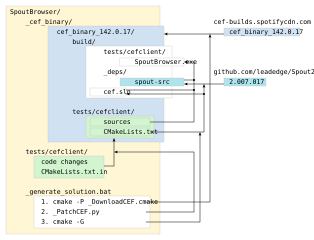

SpoutBrowser adds [Spout](https://spout.zeal.co/) texture-sending support to a Chromium-based browser.  
This enables using any web content - WebGL, shaders, interactive pages - as a live video source in VJ software such as Resolume, MadMapper, and others.

# Implementation

This project is a fork of the Chromium Embedded Framework (CEF): https://github.com/chromiumembedded/cef  
It is based on the classic CEF sample application [cefclient](https://github.com/chromiumembedded/cef/tree/master/tests/cefclient).

Modifications to the CEF source are intentionally minimal to keep upgrading to newer CEF versions straightforward.  
(This is the key difference from the existing [cef-spout](https://github.com/fg-uulm/cef-spout) project by Florian Geiselhart and the reason this project was created.)

Spout integration uses CEF's off-screen rendering mode with shared textures and D3D11 rendering.  
See the [SpoutBrowser_TextureSender](tests/cefclient/spout_browser) module for details.

# Build

Prerequisites: Visual Studio 2022; CMake 3.21+; Python 3.9–3.11.  
Refer to the [CEF Project Setup](https://github.com/chromiumembedded/cef-project#setup) for details.

### Quick Start
1. Run `_SpoutBrowser_generate_solution.bat`. 
2. Open the generated solution: `/_cef_binary/[cef_distribution_name]/build/cef.sln`.
3. Build the **cefclient** project.

### Build Workflow
The build script automates the setup by working on top of prebuilt CEF binaries (similar to [cef-project](https://github.com/chromiumembedded/cef-project)):

1. **Download**: Fetches the specified CEF distribution into `/_cef_binary`.
2. **Patch**: Injects SpoutBrowser source code and modifies CMake scripts within the CEF directory.
3. **Generate**: Runs CMake to create the VS solution (this also fetches the Spout2 dependency).

The diagram below illustrates the sequence of operations performed during the build process.

# Licenses

SpoutBrowser consists of several components with different licenses:

1. Chromium Embedded Framework (CEF)  
   Licensed under the BSD 3-Clause License.
   See LICENSE.txt for the original CEF license.

2. Spout (external dependency)  
   Spout is not included in this repository but is downloaded during CMake configuration.
   Spout is licensed under the BSD 2-Clause License:
   https://github.com/leadedge/Spout2

3. SpoutBrowser code  
   All additional code written specifically for SpoutBrowser is licensed under the MIT License.
   See LICENSE.spoutbrowser.txt for details.

